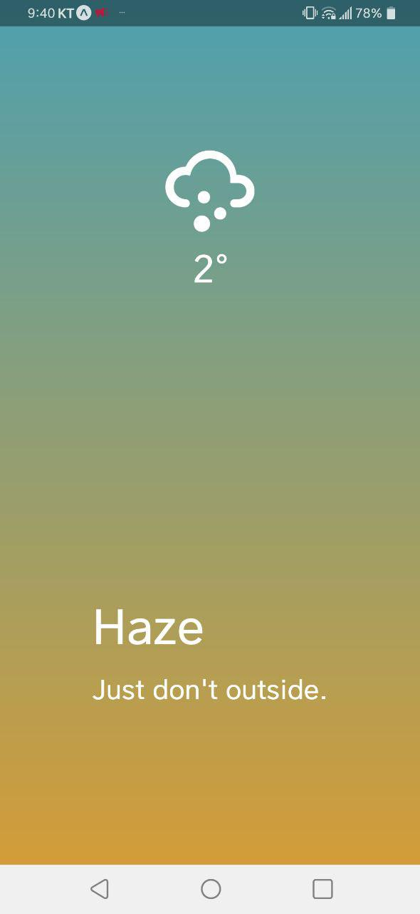

### forkin-weather

{: height="300"}

This Project is just clone coding.
I watched this lecture and created this project.
<https://academy.nomadcoders.co/courses/216885/lectures/10903202>

#### How to Run this Project?
1. First, You Must install Nodejs >= 10.0 (npm >= 6.0)
2. And, DownLoad this Project. ($ git clone https://github.com/leekanghyo/forkin-weather.git)
3. Open You'r Terminal, Install this using npm
<pre>
<code>
$ cd fokin-weather
$ npm install -g expo-cli
$ npm install
$ npm start
</code>
</pre>
#### Using Tech
* Nodejs
* React-Native
* Expo
* OpenWeatherMap API (You Must Sign Up and Get API KEY) <https://openweathermap.org/>
* With VS Code :)